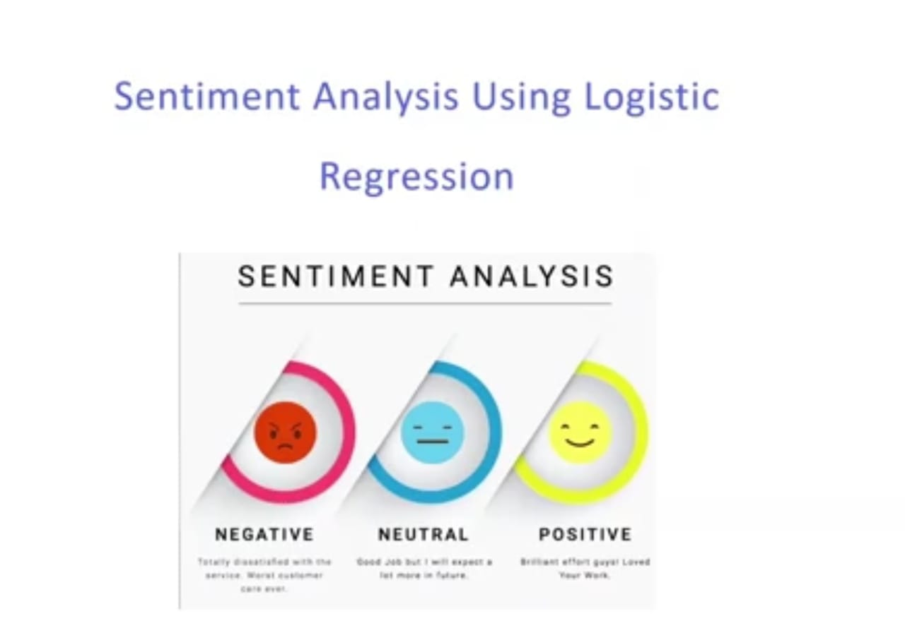

  
 

 <i> <h2> Sentiment Analysis </h2>

<h3><i>Sentiment analysis (or opinion mining) is a natural language processing technique used to determine whether data is positive, negative or neutral. Sentiment analysis is often performed on textual data to help businesses monitor brand and product sentiment in customer feedback, and understand customer needs. </h2>

 

<h2> Project details

<h3> This project is divided into three parts that are:  
<h3>1. Building our sentiment analysis model
<h3>2. Building a web application on which we can mount our model.
<h3>3. Lastly deploying the web application on Heroku.

     
  
 
<h2> Building features and Logistic Regression model
<h3> Firstly we will understand how to deal with text data and produce feature set from the data. Second, we will build our own Logistic Regression model to predict sentiment of the data. </h3>
    

   

 

  <h2> Tech Stack   </h2>
<h3> 1.Python  
<h3> 2.DJango  
<h3> 3.NLP  
<h3> 4.Logistic Regression 

     
  
  <h1> Screenshots </h1>
  <h2> Input Screen </h2>
 
  
    
  
<h2> Output Screen </h2> 

   
  
    

### Give It a Star if you liked the project 
